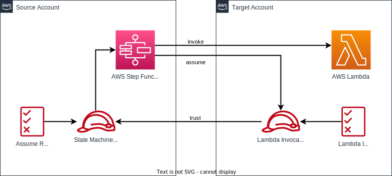

# cdk-aws-cross-account-lambda

This project makes use of the recently added [cross‑account access capabilities for AWS Step Functions](https://aws.amazon.com/blogs/compute/introducing-cross-account-access-capabilities-for-aws-step-functions/). Thanks to this new feature, tasks in your Step Functions workflow can take advantage of identity-based policies to directly invoke resources in other AWS accounts.

## Prerequisites

For this project you need two AWS accounts, both with the [CDK bootstrapping](https://docs.aws.amazon.com/cdk/v2/guide/bootstrapping.html) process completed.

## Installation

Install AWS CLI:

```sh
curl -Lo awscliv2.zip https://awscli.amazonaws.com/awscli-exe-linux-x86_64.zip
unzip awscliv2.zip
sudo ./aws/install
```

Install CDK:

```sh
npm install -g aws-cdk
```

Install Poetry + dotenv plugin:

```sh
curl -sSL https://install.python-poetry.org | python3 -
poetry self add poetry-plugin-dotenv
```

Configure Poetry to create the virtualenv inside the project's root directory:

```sh
poetry config virtualenvs.in-project true
```

Create the virtualenv and install all the dependencies inside it:

```sh
poetry install
```

## Configuration

In order to deploy to two different AWS accounts, you need to [set two AWS CLI profiles](https://docs.aws.amazon.com/cli/latest/userguide/cli-configure-files.html#cli-configure-files-methods). Both profiles must have the `region` setting configured.

After that, rename `.env.example` to `.env` and add your profiles like in the following example:

```dotenv
AWS_PROFILE_SRC=profile-dev
AWS_PROFILE_TRG=profile-prod
```

## Deployment

Synthesize the CloudFormation stacks and deploy them:

```sh
poetry run make deploy
```

## Cleanup

Destroy the CloudFormation stacks:

```sh
poetry run make destroy
```

## Architecture Diagram


